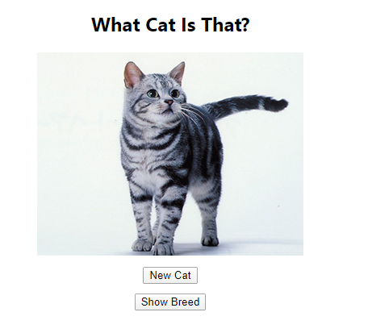
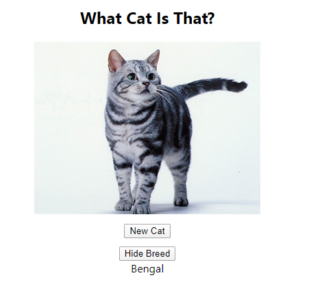

# What Cat Is That?

Application to test your knowledge of cat breeds. 

Built using React and calling [TheCatApi](https://thecatapi.com/).

## Screenshots




## Installation

Please replace abc123 below with your personal api key from signing up at [TheCatApi](https://thecatapi.com/)
```
git clone git@github.com:Hyan18/what-cat-is-that.git
cd what-cat-is-that
touch .env
echo "REACT_APP_CAT_API_KEY=abc123"
yarn install
yarn start
```
The browser should start up automatically, otherwise, navigate to ```localhost:3000```

## Run Tests

To run tests
```
yarn test
```
To run the linter (eslint)
```
yarn lint
```
To check coverage
```
yarn coverage
```

## User Stories

```
As a user
So I can look at cats
I want to see a picture of a cat
```

```
As a user
So I can know the breed of a cat
I want to see the name of the breed with the picture
```

```
As a user
So I can try to guess the breed
I want to have to toggle to see the breed
```

```
As a user
So I can look at various cats
I want to be able to click to see a new cat
```
